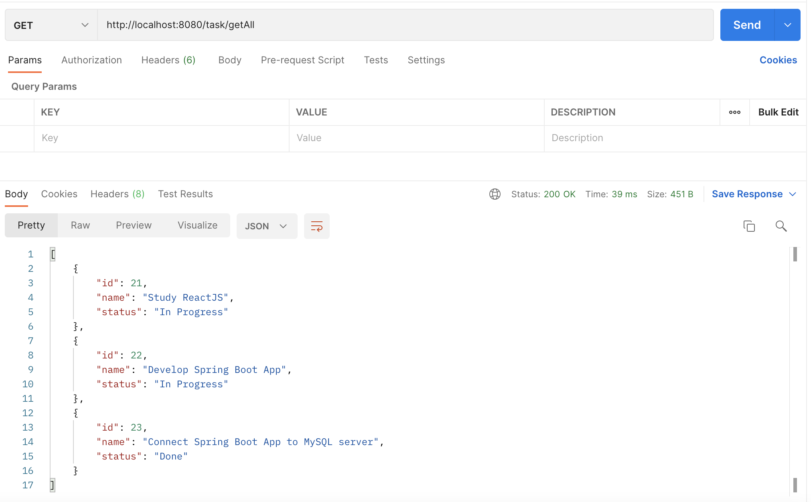
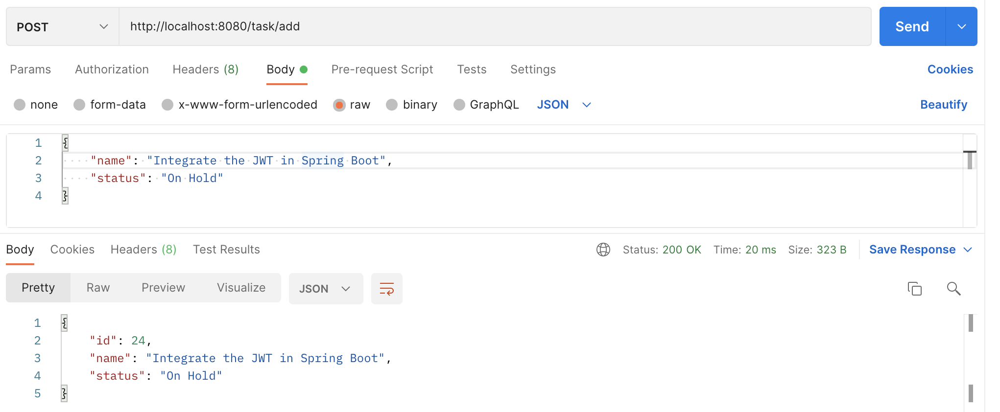
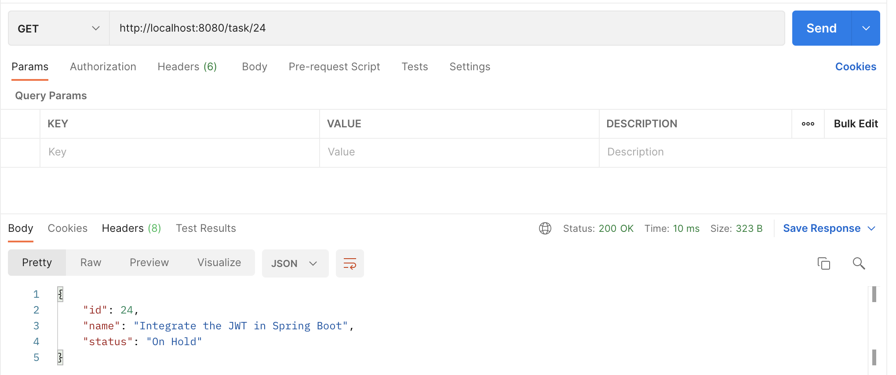
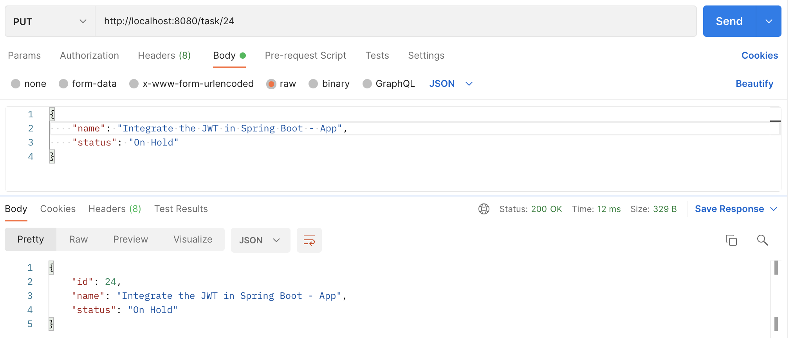
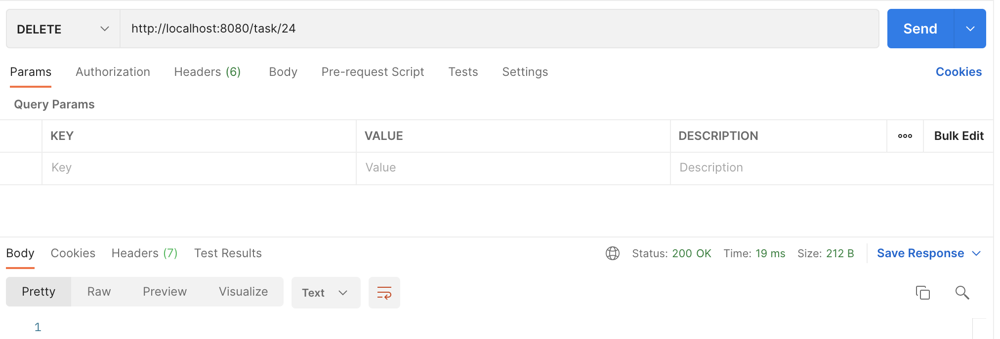

# Todo Backend App

This an small JAVA backend application that supports the Task Controller that exposes the next endpoints for a TODO app using the next technologies:

[Spring Boot](https://spring.io/projects/spring-boot) \
[Spring Data JPA](https://spring.io/projects/spring-data-jpa) \
[MySQL](https://www.mysql.com/) 

